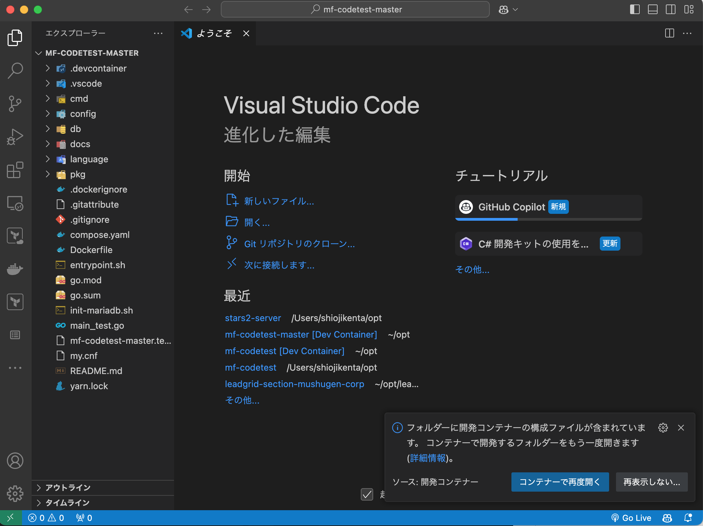
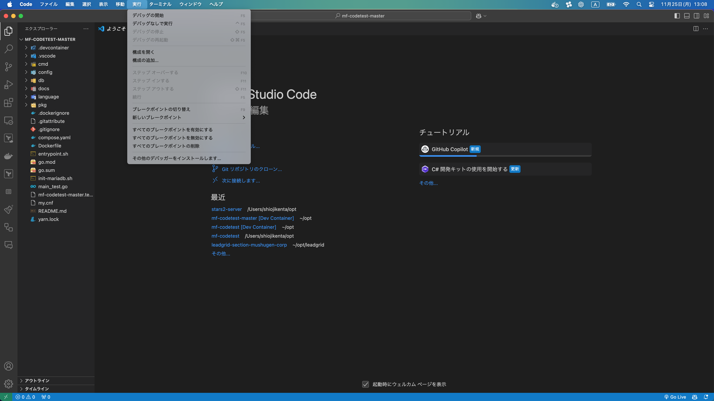
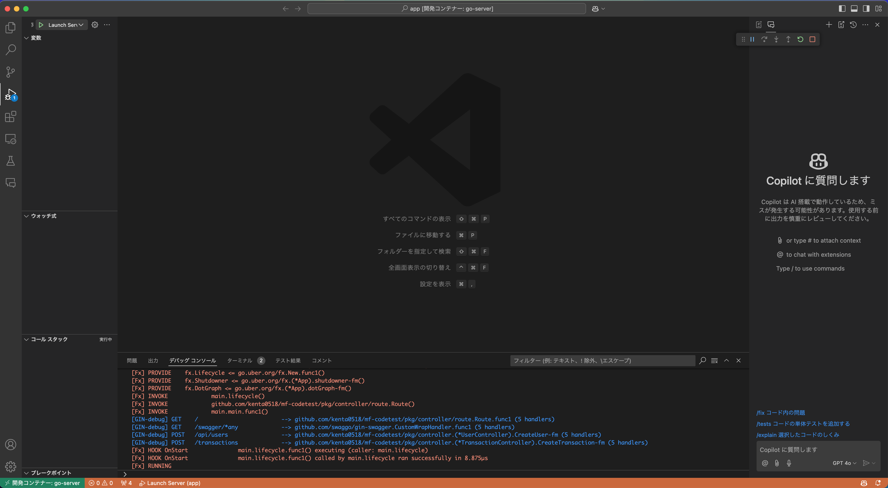

# codetest

## 手順

1. 右下の「Reopen in Container」をクリックする。もしポップアップが表示されなければ、左下緑色ボタンから「Reopen in Container」を選択できる。
   

2. `実行(R)`>`デバッグの開始`をクリックする。以下のようにデバッグコンソールが表示されれば OK です。
   
   

3. [http://localhost:8888](http://localhost:8888)にアクセスし、以下のレスポンスが確認できれば OK です。

## 課題

テストがパスするようにDockerイメージを作成してください。

テストコード(main_test.go)を変更する以外はどのような手を使っても構いません。制限時間もありません。

サンプルとしてmain.goを配置していますが、使用言語の制約も無いため、Go以外の言語で実装しても構いません。

## プロジェクト概要

ユーザーごとに「取引(Transaction)」（金額と商品説明からなる情報）を登録することができるサービスです。

ユーザーごとに登録可能な取引の金額累計に上限(1000)があり、それを超えて登録しようとすると特定のレスポンスステータスを返してエラーになる仕様です。

RDBMSとしてMySQLを使う想定でdbディレクトリ以下にスキーマを置いています。

## 開発

`docker compose up`でダミーのアプリケーションコンテナとスキーマが反映されたMySQLを起動できます。

## 評価

評価観点の9割はテストがパスしているかどうかになります。

その他についてどのように工夫していただいても構いませんが、評価には影響しないため、必要十分な実装を目指すことを推奨しています。

## 提出方法

課題に対する実装を含んだ状態でリポジトリ全体をZIP形式でまとめ、所定のアップロードフォームでアップロードしてください。